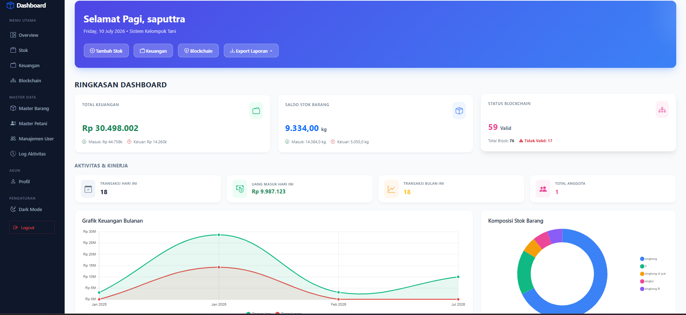

# Sistem Manajemen Stok Tani (TaniChain)

  

Aplikasi sistem informasi pengelolaan stok hasil tani, pencatatan keuangan, dan data master petani yang terintegrasi dengan riwayat aktivitas digital (Audit Trail / konsep sederhana Blockchain).

## Fitur Utama
- **Dashboard Overview**: Ringkasan data (Stok, Saldo, Transaksi) beserta grafik interaktif (Chart.js) yang memvisualisasikan data masuk dan keluar.
- **Manajemen Stok**: Penambahan, pengurangan, dan riwayat pergerakan stok hasil tani secara real-time.
- **Keuangan**: Pencatatan nilai uang (pemasukan & pengeluaran) dari transaksi stok secara otomatis.
- **Master Data**: Kelola daftar Petani/Pemasok dan referensi Data Barang dengan mudah.
- **Log Aktivitas (Audit Trail)**: Setiap perubahan data penting dicatat dan tidak dapat dihapus, mensimulasikan sistem *immutable ledger*.
- **Dark Mode**: Dukungan mode gelap dinamis yang memanjakan mata untuk seluruh antarmuka aplikasi.
- **Print Struk**: Cetak struk transaksi individual untuk keperluan administrasi fisik.

## Teknologi
- **Backend**: Laravel 11 (PHP 8.2+)
- **Frontend**: Blade Templating, Vanilla CSS, Bootstrap 5, Axios
- **Database**: MySQL

## Cara Instalasi
1. Clone repositori ini: `git clone https://github.com/eko190403/Sistem-Manajemen-Stok-Tani.git`
2. Masuk ke direktori: `cd Sistem-Manajemen-Stok-Tani`
3. Jalankan `composer install`
4. Salin file `.env.example` menjadi `.env`
5. Atur koneksi database Anda di file `.env`
6. Jalankan `php artisan key:generate`
7. Jalankan migrasi: `php artisan migrate`
8. (Opsional) Jalankan *seeder* jika ada.
9. Jalankan server lokal: `php artisan serve`
